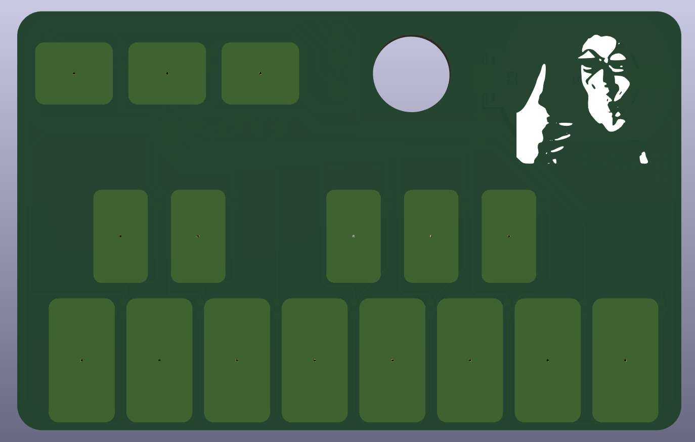
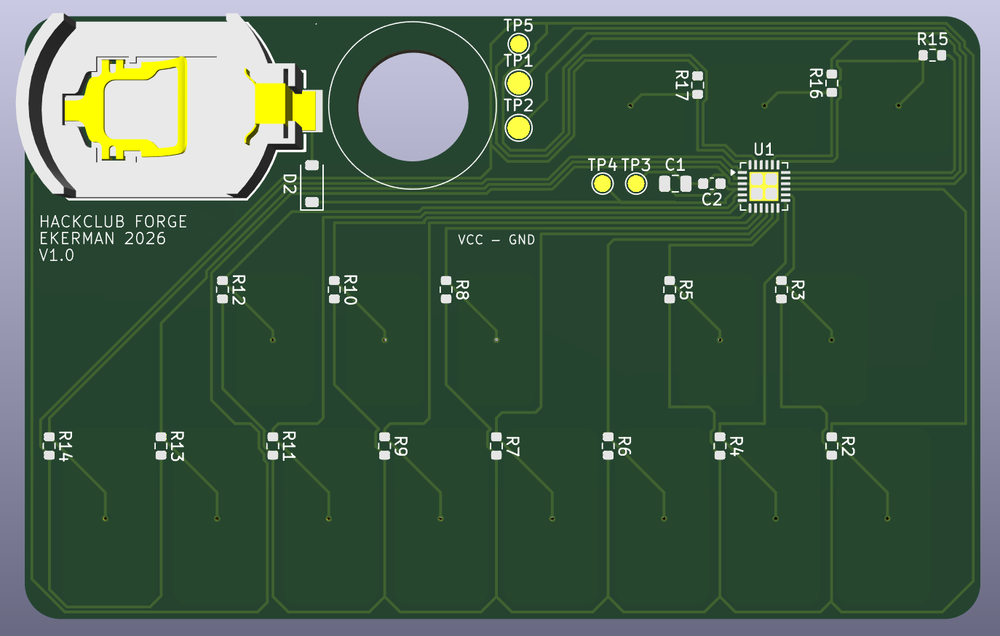

# STTS — Pocket Synth

A **behbeh** credit card sized synth for your wallet. The keys are a full octave ad you can go up and down 2 more. The noise from a piezo disc which is why theres a hole in the board.

## Features (this feels like a sales pitch lol)

- 13 touch keys (C to high C), octave down, octave up, and mode
- Three play modes of plain, arpeggio, vibrato
- Octave shift of ±2
- Differential piezo drive for hopefully double the volume of a normal buzzer
- Runs on one CR2016 coin cell, auto sleeps after 30 s, hold MODE to wake

## How it works

- **MCU:** ATtiny1617 (24 pin QFN), programmed over UPDI
- **Touch sensing:** each key is a copper pad under soldermask, connected to a MCU pin and to a shared TOUCH_SEND line on a 1 MΩ resistor. The firmware times how long each pad takes to charge a finger adds capacitance and makes it slower. Each pad is calibrated at power on.
- **Speaker:** a 15 mm piezo disc glued over a 10 mm hole, driven from two pins in opposite phase. Touch readings are timed between speaker transitions to avoid interference.
- **Power:** CR2016 → B5819W Schottky diode (blocks the programmer from back feeding the coin cell) → 10 µF + 100 nF decoupling.
- **Layout:** all components are on the back. Nothing sits behind the white keys, and no key's trace runs behind a different key, to keep keys from triggering each other.

## Repo layout

| Folder | Contents |

| `hardware/` | KiCad 9 project (schematic, PCB, custom footprints in `libs/`) |
| `firmware/STTS/` | Arduino sketch (megaTinyCore) |
| `production/` | Gerbers, BOM, and placement (CPL) files for JLCPCB |
| `images/` | Beautiful renders and screenshots |

## Bill of materials

Assembled by JLCPCB (Economic PCBA, bottom side), 5 boards.

| Part | Qty per board | LCSC |

| ATtiny1617 MNR | 1 | C614176 |
| 1 MΩ 0603 resistor | 16 | C22935 |
| 10 µF 0805 capacitor | 1 | C15850 |
| 100 nF 0603 capacitor | 1 | C14663 |
| B5819W Schottky diode | 1 | C8598 |
| CR2016 SMD holder | 1 | C964740 |
| 15 mm piezo disc (hand soldered like a pro) | 1 | — |

**JLCPCB quote (5 assembled boards, 0.8 mm): ~$50** `images/jlc-quote.png`.

## Building and flashing

1. Install the Arduino IDE and add **megaTinyCore** through the Boards Manager.
2. Settings: Chip **ATtiny1617**, Clock **5 MHz internal**, millis() timer **TCA0 or TCD0** (not TCB0, which drives the speaker), Programmer **SerialUPDI**.
3. Wire a 3.3 V USB serial adapter as a SerialUPDI programmer to the GND / UPDI / VCC pads on the back. **Take the coin cell out before connecting VCC.**
4. Run **Burn Bootloader** once to set the clock fuses, then **Upload**.

## Status

Schematic                                        yeye
PCB layout (DRC clean)                           yeye
Firmware v0.1 (compiles untested on hardware)    yeye
Boards ordered                                   nono
Bring up and touch tuning                        nono

## Notes

Designed by yours truly EthanKerman for [Hack Club Forge](https://forge.hackclub.com)
